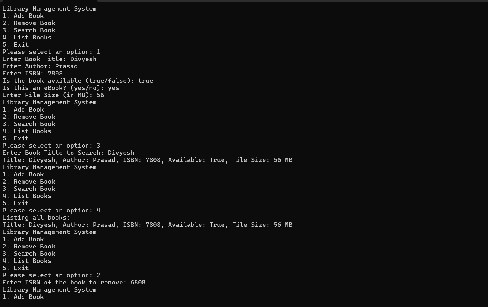
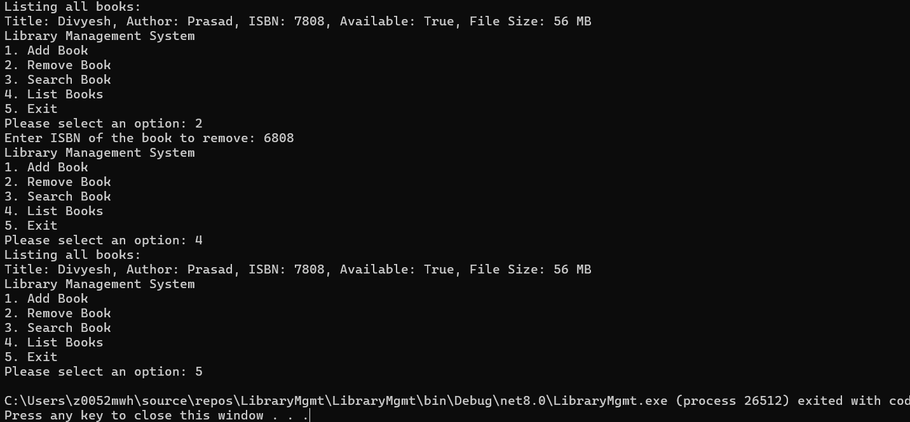

# Library Management System

## Introduction

This is a simple Library Management System built using Object-Oriented Programming (OOP) principles, SOLID design principles, and basic design patterns in C#. The system is designed to manage books and eBooks, with features like adding, removing, searching, and listing books in the library. The implementation also demonstrates the use of the Singleton and Factory design patterns.

## Features

- **Add a new book or eBook**: The system allows users to add books and eBooks to the library.
- **Remove a book by ISBN**: Books can be removed from the library using their ISBN.
- **Search for books by title**: Users can search for books by their title.
- **List all available books**: The system can display all books currently available in the library.
- **Display download size for eBooks**: For eBooks, the download size (in MB) is shown.

## SOLID Principles Applied

- **Single Responsibility Principle (SRP)**: 
  The LibraryManager class has only one responsibility, which is to manage the library’s operations. All other functionalities like book creation and listing are handled by other classes.

- **Open/Closed Principle (OCP)**: 
  The system is open for extension but closed for modification. For example, the `Book` class can be extended by the `EBook` subclass without modifying the existing `Book` class.

- **Liskov Substitution Principle (LSP)**: 
  The `EBook` class is a subclass of the `Book` class and can be used interchangeably where a `Book` object is expected, ensuring that the system works correctly with both regular books and eBooks.

- **Interface Segregation Principle (ISP)**: 
  The system uses specific interfaces for operations related to books, ensuring that classes are not forced to implement unnecessary methods.

- **Dependency Inversion Principle (DIP)**: 
  The system depends on abstractions (interfaces) rather than concrete implementations, ensuring flexibility and easier testing.

## Design Patterns Applied

- **Singleton Pattern**: 
  The `LibraryManager` class is refactored to implement the Singleton pattern, ensuring that only one instance of the LibraryManager exists throughout the application.

- **Factory Pattern**: 
  The `BookFactory` class is responsible for creating instances of `Book` or `EBook` based on the input parameters. This allows the system to easily create different types of books without modifying the core logic.

## How to Run the Program

1. Download or clone the project files.
2. Open the solution in Visual Studio.
3. Build the solution.
   dotnet build
5. Run the project.
   dotnet run

   A console-based menu will appear that allows you to interact with the library system.
   - Choose an option to add a book or eBook.
   - Search for a book by title.
   - Remove a book by ISBN.
   - List all available books.

## Key Enhancements in Each Part

### Part 1: Basic Library Management System
- Created the `Book` class with attributes like title, author, ISBN, and availability status.
- Created the `Library` class to manage a list of books with methods to add, remove, search, and list books.

### Part 2: Enhancing with OOP Principles and Inheritance
- Extended the `Book` class to create an `EBook` subclass with an additional attribute for file size.
- Implemented the `LibraryManager` class to follow the Single Responsibility Principle and manage library operations.

### Part 3: Applying SOLID Principles and Design Patterns
- Refactored the `LibraryManager` class to implement the Singleton pattern.
- Created a `BookFactory` class to implement the Factory pattern and dynamically create instances of books and eBooks.

## Screenshots

Included the screenshots of the program's execution showing the following:
- Adding a book or eBook.
- Searching for a book by title.
- Removing a book by ISBN.
- Listing all books in the library.
- Displaying the download size for an eBook.

  
  

## Conclusion

This project demonstrates how to apply Object-Oriented Programming concepts, SOLID principles, and design patterns like Singleton and Factory to create a robust, scalable library management system in C#. The system provides a basic but functional library management interface that can be extended with additional features in the future.
